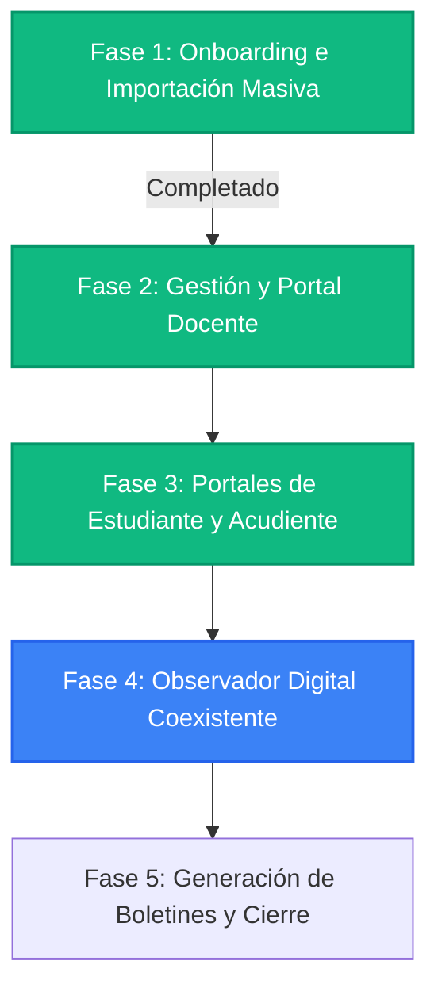

# Roadmap del Proyecto - Sophos Core SaaS

Este documento detalla el plan estratégico de desarrollo para convertir a Sophos Core en un producto SaaS de gestión escolar completamente comercializable.

---

## Estado Actual y Progreso

---

## Desglose de Fases de Desarrollo

### 🟢 Fase 1: Carga Masiva y Onboarding (Completado)

**Objetivos:** Permitir que los colegios importen su información inicial de forma robusta e inmediata.

**Componentes clave:**
- [x] Base de datos multi-tenant y seguridad RLS de Supabase.
- [x] Redirección automática (`sessionGuard`) para primer inicio de sesión.
- [x] Formulario de cambio de contraseña obligatorio (`must_change_password`).
- [x] Importación transaccional masiva de Estudiantes, Docentes y Acudientes en lote (menos de 10 segundos).
- [x] Script unificado de utilidades de base de datos (`db-util.js`).

---

### 🟢 Fase 2: Configuración Académica y Portal del Docente (Completado)

**Objetivos:** Permitir que los docentes alimenten el sistema con las clases y notas diarias.

**Componentes clave:**
- [x] **Configuración de Periodos Escolares (Admin):** Tabla y asistente Onboarding para definir fechas de periodos.
- [x] **Planilla de Notas del Docente:** Interfaz interactiva y soporte de exportación/importación offline de planillas de calificaciones en CSV.
- [x] **Planilla de Control de Asistencia:** Toma de asistencia diaria parametrizada (mapeando faltas justificadas e injustificadas).

---

### 🟢 Fase 3: Portales de Consulta - Estudiante y Acudiente (Completado)

**Objetivos:** Dar acceso a las familias para hacer seguimiento del rendimiento en tiempo real.

**Componentes clave:**
- [x] **Portal del Estudiante:** Visualización de semáforo académico, promedio acumulado, periodos y asistencia de forma directa.
- [x] **Portal del Acudiente:** Panel unificado familiar con selector de estudiantes acudidos, cargado de boletines parciales e inasistencias.

---

### 🔵 Fase 4: Observador Digital de Estudiantes (Recomendado Continuar Aquí)

**Objetivos:** Digitalizar la bitácora de comportamiento y convivencia del colegio, un elemento legal obligatorio en muchos países de Latam.

**Tareas sugeridas:**
- [ ] **Registro de Novedades (Docente/Coordinador):**
  - Panel para añadir observaciones a la hoja de vida del estudiante (comportamiento excelente, llamado de atención leve, falta grave, etc.).
- [ ] **Vínculo de Firma y Aceptación (Acudiente):**
  - Notificación inmediata al acudiente al registrarse una anotación.
  - Botón para que el acudiente "Firme digitalmente" de enterado en el portal.

---

### ⚪ Fase 5: Reportes y Cierre de Periodo

**Objetivos:** Procesar boletines finales y cerrar ciclos administrativos.

**Tareas sugeridas:**
- [ ] **Cierre de Periodo:**
  - Algoritmo de cálculo de promedios ponderados y guardado histórico de boletines cerrados.
- [ ] **Generación de Boletines Escolares en PDF:**
  - Utilidad en el servidor para generar el boletín académico tradicional en formato PDF, listo para impresión o descarga.
- [ ] **Estadísticas Escolares (Admin):**
  - Gráficos del índice de reprobación, estudiantes destacados y ausentismo general de la institución.
